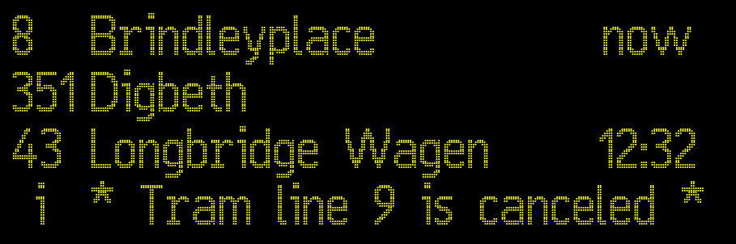
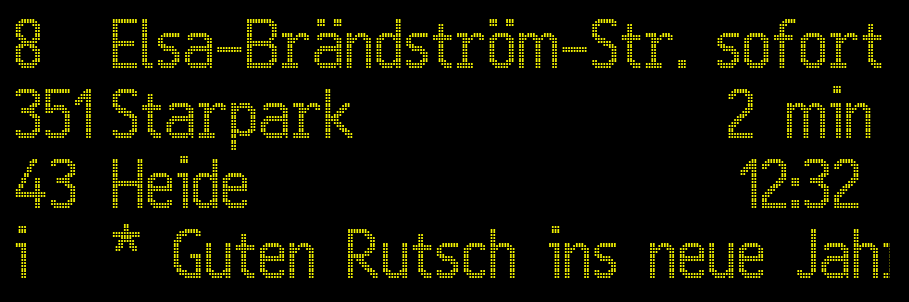

# PIDasGIF

Create an animated GIF file to simulate a passenger information display.

## Exemplary results

## Usage

1. Adapt the content of the table
2. Press button to add this as slide
3. Repeat steps 1 and 2 until you have all slides you need
4. Use button `Create Animation` to create the GIF image
5. Use download button to download the GIF file

## Todo

- Check if [gif.js](https://github.com/jnordberg/gif.js) can replace jsgif - gif.js should be faster
- Video export option: ogm, wmv, mpg, webm, ogv, mov, asx, mpeg, mp4, m4v or avi
- Refactoring

## Third-Party

This is an overview of the third-party software and data we use. Many thanks to the open source community, especially to the authors of the following projects! ❤️ 🍻

| software  | license  | version   | purpose   |
| --------- | -------- | --------- | --------- |
| [24 LED](https://fonts2u.com/24-led.font) | General Public License with font-exception and Open Font License | 0.001 2009 | Font |
| [html2canvas](https://github.com/niklasvh/html2canvas/) | MIT | 1.3.3 | Convert the table to a canvas |
| [jsgif](https://github.com/egfx/jsgif) | MIT | 2021-03-07 | Convert canvases to animated GIF |
